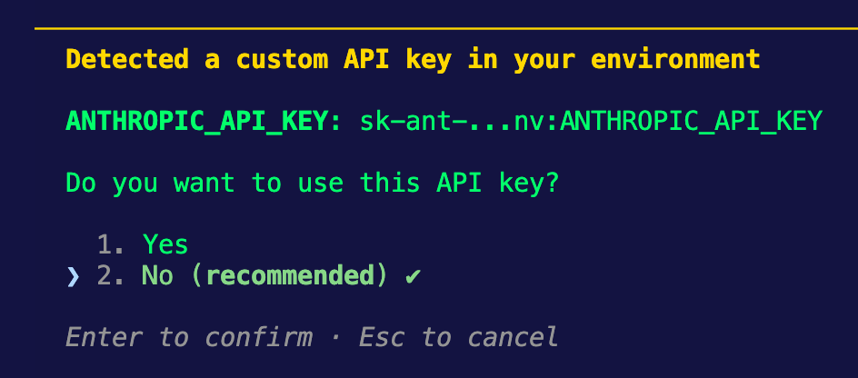

1. Install OpenShell

```
curl -LsSf https://raw.githubusercontent.com/NVIDIA/OpenShell/main/install.sh | sh
```

2. We're going to be changing this up in the next lab, but for now just so you can see how it works, run the following:
```
openshell sandbox create -- claude
```

3. You'll be dropped into Claude Code much like on your local terminal.
