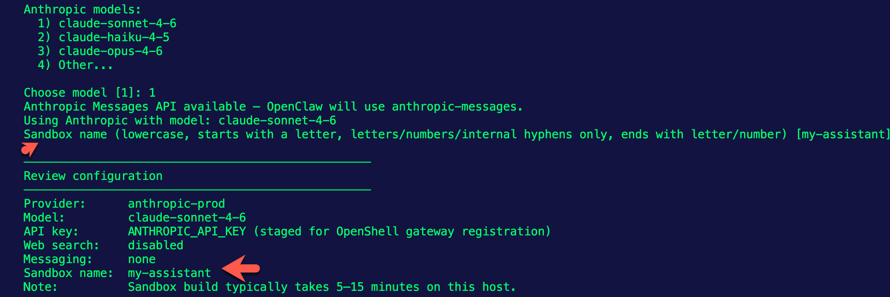
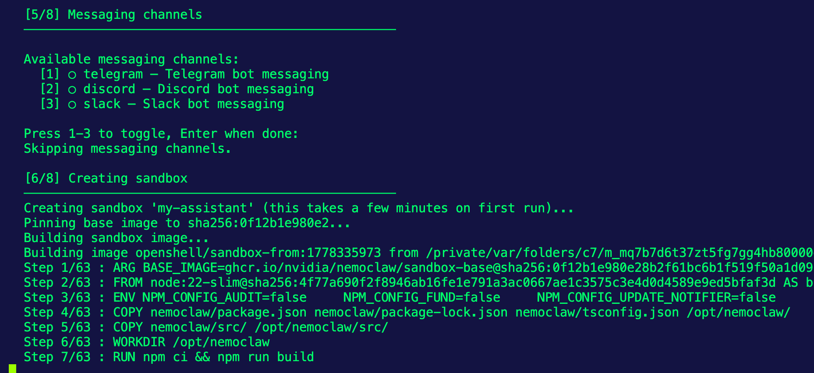

1. Install NemoClaw
```
curl -fsSL https://www.nvidia.com/nemoclaw.sh | bash
```

2. Start the onboarding process. Using `8081` because the Docker Desktop Backend uses `8080`.
```
NEMOCLAW_GATEWAY_PORT=8081 nemoclaw onboard
```

3. You'll be prompted with several options like Model to use, name, etc. When you get to the Model selection, you'll see that a Sandbox is being created for you. OpenShell is deployed automatically when you `nemoclaw onbard`.



4. You'll see that the onboarding creates a container image. That's where NemoClaw and OpenShell runs.



5. Start working with your NemoClaw client:
```
nemoclaw my-assistant connect
```

6. You can also use it in non-interactive mode.
```
openclaw agent --agent main --local -m "hello" --session-id test
```